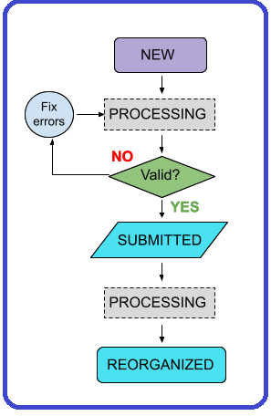
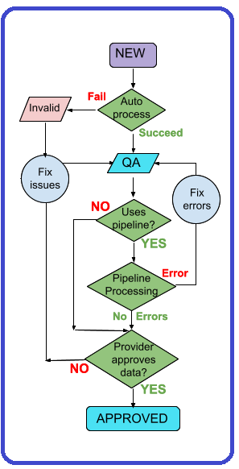

## Section 10 - Data Processing

Details about Ingestion Statuses 

### Ingestion Statuses 
These statuses display in the ingestion portal as a data set is processed.

#### Data Upload Flow Diagram 

| Status | Explanation / Comments |
|:---------------------|:----------------------------------------------------|
| **New** | Data upload registered; Globus upload directory created.  Data provider has uploaded data. After HIVE (or CODCC) validation, status changes to <em>Submitted </em>when the data provider hits the submit button on the upload. <strong>Prerequisite: </strong>Local validation of data by provider prior to data upload.|
| **Processing** |The data upload is being processed and is not editable. A transient state (between other states) while automated processes act on the upload.|
| **Valid** | Every data upload is reorganized into data sets. This is a semi-automated process. If the data upload is valid, data curation can kick off this process.|
| **Submitted** | Data upload submitted for validation and processing by the HIVE or CODCC. The data upload can be automatically or manually ingested. Status changes to _Processing_ when data curation presses the “Validate” button. |
| **Reorganized** | Data curation hits the “Reorganize” button to kick off automated processing that generates the data sets. The status of the upload changes to _Reorganized_ when this completes.|
| **Invalid** | The data upload did not pass HIVE (or CODCC) validation or a failure occurred during processing. Someone from the HIVE (or CODCC) will contact the data submitter to address this status. |
| **Error** | An (unspecified) error occurred during HIVE or CODCC processing. |

**Data Processing: Ingestion, HIVE / CODCC Validation, and Processing**

| Step | Comments |
|:---------------------|:----------------------------------------------------|
|_Prerequisites:_ | |
|&nbsp; &nbsp; • Upload All files to Globus. | All data files are uploaded into the team’s Globus folder. |
|&nbsp; &nbsp; • Each dataset has a directory | Each dataset has a corresponding directory and row in an associated metadata template file.|
|&nbsp; &nbsp; • Each row in a template = one dataset | Multiple metadata template files can be included, but at least one is _required_. |

**NOTE:** Multiple sets of data can be uploaded and the same data set _could_ be uploaded more than once. Each data upload is assigned a UUID (universally unique identifier), but not a version number, until it has completed the entire data ingest, validation, and approval process and is published.

| Step | Comments |
|:---------------------|:----------------------------------------------------|
|&nbsp; 1. Email the <a href="mailto:help@hubmapconsortium.org">HuBMAP Helpdesk</a> OR   &nbsp; &nbsp; &nbsp; <a href="mailto:help@sennetconsortium.org">SenNet Helpdesk</a> | Once all the files associated with an upload have been uploaded.   This lets them know that the upload is ready for ingestion (not an automated process).   **IMPORTANT:** Include the _root path(s)_ of the specific data upload(s) in the email. |
|&nbsp; 2. The HIVE (or CODCC) extracts | Each data upload, corresponding data, and registers them as individual datasets. |
|&nbsp; 3. The HIVE (or CODCC) processes | The data and metadata that you have uploaded for ingestion. If ingestion fails, or if additional information is needed, the data provider will be contacted using the ticketing system.|

 **NOTE:** For Clinical assay data, the Pitt team will de-identify this data and submit the scrubbed data to the HIVE / CODCC. The provider of the data will need to review and approve the release of the de-identified data in the <a href="#publication">publish step</a>.

| Step | Comments |
|:---------------------|:----------------------------------------------------|
|&nbsp; 4. Pipeline processing | The HIVE processes certain assays by standardized pipelines (where applicable). |
|&nbsp; &nbsp; a. CODEX | Cyclic immunofluorescence imaging: Pipeline uses Cytokit + SPRM | 
|&nbsp; &nbsp; b. ATAC-seq | (Including sc-, sn-, and bulk variants): Pipeline uses SnapTools + SnapATAC |
|&nbsp; &nbsp; c. RNA-seq | (Including sc-,sn-,bulk): Pipeline uses Salmon + Scanpy + scVelo |
|&nbsp; &nbsp; d. Other imaging data: | SPRM |

Additional pipelines will be added over time, as needed. Pipelines are available for download use by others, including TMCs.   **NOTE:** Generally, TMCs are not involved with pipelines, but may be contacted if an error occurs.

Details about Dataset Statuses 

### Dataset Statuses 

These statuses apply to datasets created from a data upload. Once a data upload has been reorganized into datasets, each dataset passes through the system, ideally progressing from New to QA to Approved.

#### Dataset Flow Diagram 

| Status | Explanation / Comments |
|:---------------------|:----------------------------------------------------|
| **New** | Data upload reorganized, broken into datasets, and status set to _New_. Data curation kicks off automated processes. If successful, status changes to _QA_. If these processes fail, the status changes to _Invalid_..|
| **QA** | Dataset is ready for pipeline processing OR for Provider approval (if no pipeline processing is needed). Status changes to <em>Processing</em> when data curation presses the “Validate” button.|
| **Processing** |The data upload is being processed and is not editable. A transient state (between other states) while automated processes act on the upload.|
| **Approved** | Every data upload is reorganized into data sets. This is a semi-automated process. If the data upload is valid, data curation can kick off this process.|
| **Abandoned** | Data upload submitted for validation and processing by the HIVE or CODCC. The data upload can be automatically or manually ingested. Status changes to _Processing_ when data curation presses the “Validate” button. |
| **Invalid** | The data upload did not pass HIVE (or CODCC) validation or a failure occurred during processing. Someone from the HIVE (or CODCC) will contact the data submitter to address this status. |
| **Error** | An (unspecified) error occurred during HIVE or CODCC processing. |

